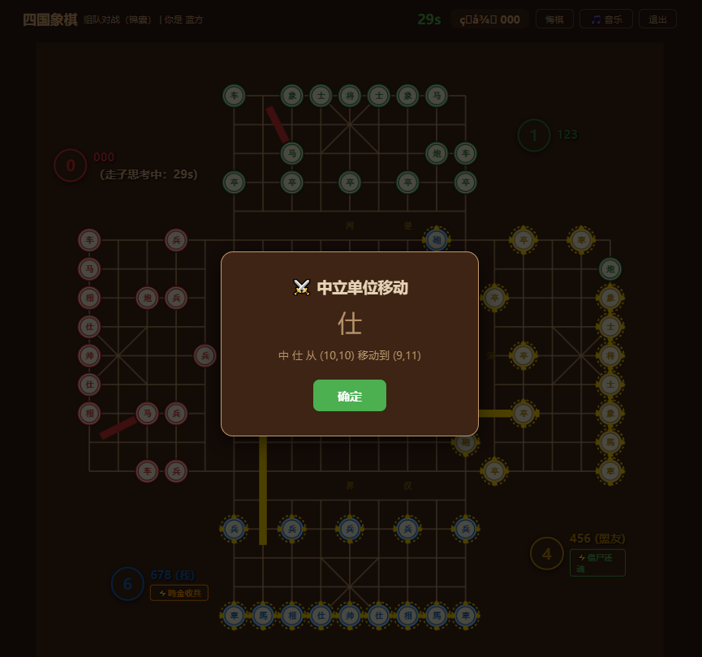
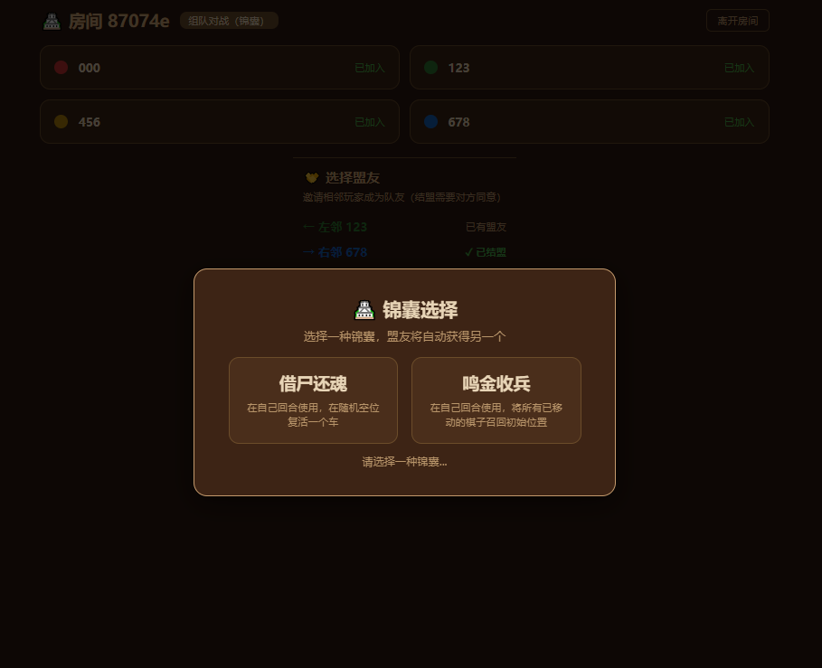
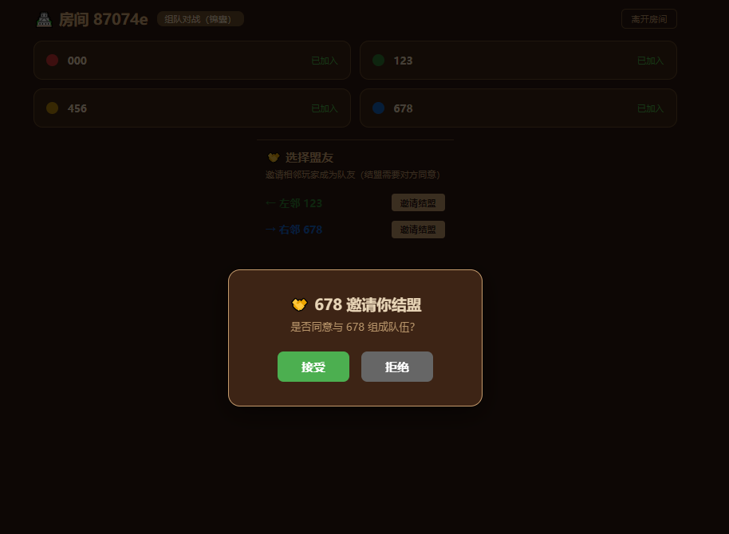

# 四国象棋 (4-Player Xiangqi)

四国象棋是一款基于网页的四人象棋对战游戏，支持局域网联机。四名玩家分别在棋盘四边，按逆时针顺序轮流走子。支持**自由对战**、**组队对战**、**组队对战·锦囊**三种模式，每个模式均可添加 AI 电脑对手。


*自由对战模式：四人各自为战*


*手机端适配效果*

## 游戏模式

### 自由对战 (FFA)
四人各自为战，最终幸存者为胜。玩家按 **红 → 绿 → 黑 → 蓝** 的顺序轮流走子。


*组队对战模式：2v2 结盟*

### 组队对战 (Team)
2v2 模式，相邻玩家两两组队。一方两名玩家全部阵亡后另一方获胜。开局可通过结盟系统配对。

### 组队对战·锦囊 (Team Stratagem)
在组队对战基础上增加锦囊系统。开局结盟后进入锦囊选择阶段，每名玩家从以下两个锦囊中选择一个，盟友自动获得另一个：

- **借尸还魂** — 在自己回合使用，在随机空位复活一个车
- **鸣金收兵** — 在自己回合使用，将所有已移动的棋子召回初始位置


*锦囊选择界面*

每局每个锦囊只能使用一次。

## 特色功能

- **AI 电脑对手** — 基于 Minimax 搜索 + α-β 剪枝的 AI，可在空位添加电脑玩家
- **多进程并行 AI** — AI 搜索运行在独立进程池中，多房间多个 AI 同时思考互不阻塞，充分利用多核 CPU
- **掉线重连** — 游戏过程中断线后重新登录可自动回到对局
- **悔棋系统** — 走子后可发起悔棋投票，队友同意后撤销
- **视角自动旋转** — 每名玩家始终看到自己的棋子在下方的视角
- **中立单位** — 棋盘中央存在中立势力，击杀中立帅可获得棋子奖励
- **淘汰奖励炮** — 消灭一方后，杀手在其底线随机生成一个炮，鼓励进攻
- **语音播报** — 回合切换时自动语音提示（浏览器 TTS）
- **音效与背景音乐** — Web Audio API 生成走子/吃子音效，支持背景音乐循环播放
- **响应式布局** — 支持桌面端和手机端访问，自动适配屏幕大小

## 依赖

- Python 3.8+
- [aiohttp](https://docs.aiohttp.org/) — Web 服务器与 WebSocket 通信

项目其余代码仅使用 Python 标准库，无其他第三方依赖。

## 快速开始

### 1. 安装依赖

```bash
pip install aiohttp
```

### 2. 启动服务器

```bash
cd xiangqi_game
python server.py
```

### 3. 打开浏览器

- 本机访问: `http://127.0.0.1:8888`
- 局域网其他设备: `http://<服务器IP>:8888`

输入用户名和密码即可自动注册登录。

### 4. 开始游戏

1. 在大厅点击"创建房间"
2. 选择游戏模式（自由对战 / 组队对战 / 组队对战·锦囊）
3. 在空位点击"+ 添加电脑"以添加 AI 对手，或等待好友加入
4. 满 4 人后点击"开始游戏"

### 5. 局域网映射到公网（可选）

使用 Cloudflare Tunnel 将服务暴露到公网：

```bash
cloudflared tunnel --url http://localhost:8888
```

## 操作说明

- 点击己方棋子查看可走的合法位置，再点击目标位置走子
- 棋子上的金色虚线花边表示己方或盟友的棋子
- 用户名下方显示锦囊图标（锦囊模式），点击可发动锦囊
- 走子超时 30 秒将由系统自动走子

## 文件结构

```
xiangqi_game/
├── server.py          # Web 服务器 + WebSocket 处理
├── game_4p.py         # 游戏核心逻辑（棋盘、走法、胜负判定）
├── ai_4p.py           # AI 搜索引擎（Minimax + α-β 剪枝）
├── ai_debug.log       # AI 调试日志
├── image/
│   ├── game_ffa.png
│   ├── game_team.png
│   ├── game_stratagem.png
│   └── game_mobile.png
├── static/
│   ├── index.html     # 前端页面
│   ├── style.css      # 样式
│   └── script.js      # 前端交互逻辑
└── README.md
```

## 注意事项

- 账户自动注册，输入用户名和密码即可登录
- 组队模式下只要一方完成结盟就会自动开始比赛
- AI 搜索深度可通过 `_MAX_DEPTH` 常量在 `ai_4p.py` 中调整
- 默认端口 8888，可在 `server.py` 中修改
